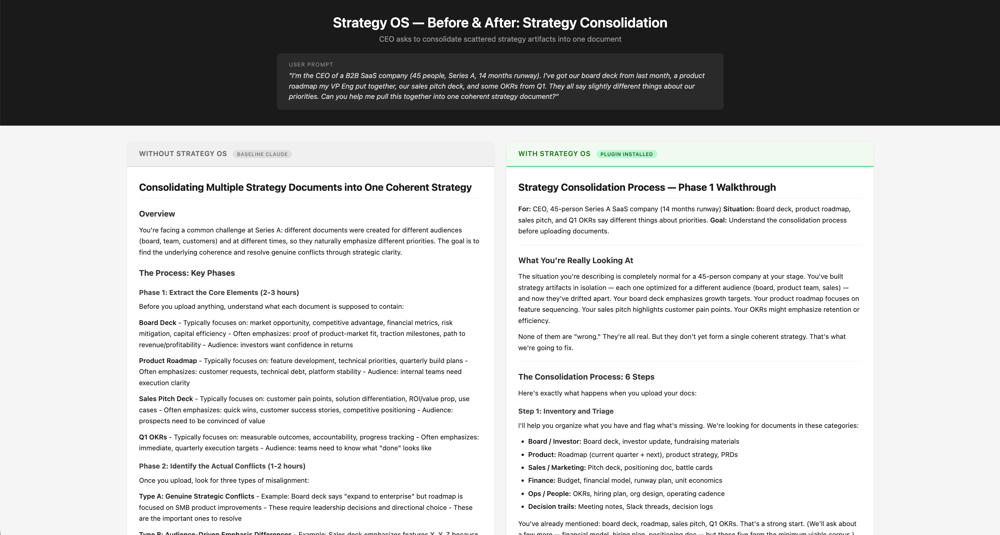
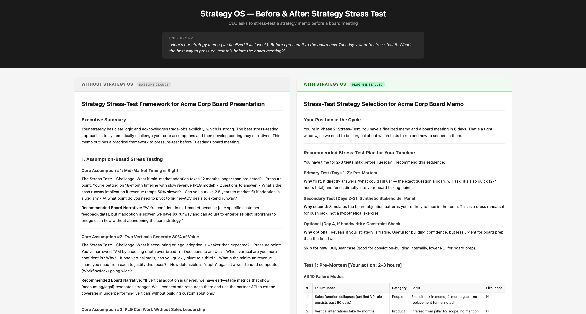
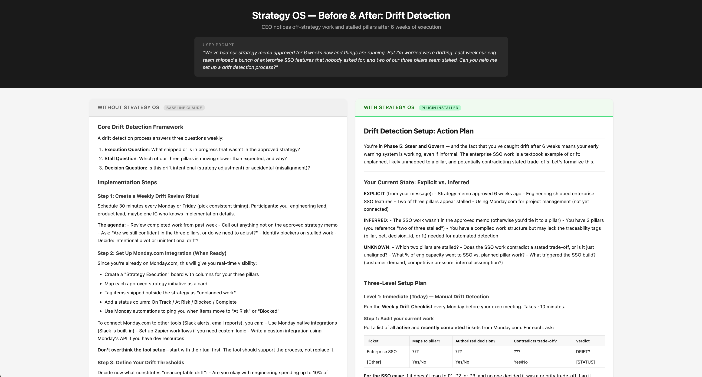

# Strategy OS

**Strategy OS turns scattered strategy artifacts into a single, testable, executable system.**

Three operating modes for Claude — a lifecycle for building strategy, a passive analyst that flags drift, and a coach that tracks your KPIs over time.

| Mode | Type | What it does |
|------|------|-------------|
| **Strategy Lifecycle** | Skill (episodic) | 5-phase workflow: consolidate, stress-test, communicate, compile, govern |
| **Strategy Analyst** | Subagent (ambient) | Watches your conversations passively, flags potential misalignments with the strategy. Advisory, never directive. |
| **Strategy Coach** | Subagent (scheduled) | KPI tracking and accountability partner. Runs setup interview, periodic check-ins, and builds an execution narrative over time. |

All three modes share a data layer at `~/.claude/strategy-os/data/` — the same location in both Claude Code and Claude Desktop.

---

## Without Strategy OS

- "Pull my strategy together" gets you generic advice about alignment frameworks
- "Stress-test this before my board meeting" returns a list of open-ended questions
- Nothing connects back to your actual documents — you get theory, not a working memo
- Every claim looks the same — you can't tell what came from your docs vs. what the AI inferred
- "Set up drift detection" gets you a suggestion to have a weekly meeting

## With Strategy OS

| Phase | Mode | What it does |
|-------|------|-------------|
| Consolidate | Strategy architect | Inventory your artifacts, extract every claim into a table, label each Explicit / Inferred / Unknown, and draft a canonical Strategy Consolidation Memo. |
| Stress-test | Adversarial reviewer | Run a pre-mortem, bull/bear case, constraint shock, or synthetic stakeholder panel. Every finding becomes a specific memo edit, not a vague concern. |
| Communicate | Comms strategist | Lock the strategy objects, then translate into board memo, all-hands story, exec alignment note, sales enablement, or CEO narrative — without drifting from the source. |
| Compile | Work architect | Map the memo to Objective → Pillars → Bets → Epics → Tickets with hypothesis-driven definitions of done and traceability tags. |
| Govern | Ops monitor | Weekly drift detection, monthly pillar reviews, quarterly planning packets, and agent guardrails for safe AI-assisted execution. |

Alongside the lifecycle, the **Strategy Analyst** watches every conversation. If you start talking about hiring, roadmap changes, or resource allocation in a way that cuts against your stated strategy, it surfaces a note before you proceed. You can dismiss it, log it, or update your strategy — but it never blocks work.

The **Strategy Coach** sets up a KPI registry in a brief interview, then checks in at whatever cadence you choose (weekly, monthly, or a mix per KPI). Each check-in logs the current value and builds a running narrative of execution health over time.

## Strategy OS Demo

```
You:    I have a board deck, product roadmap, sales pitch, and OKRs
        that all say different things. Help me get my strategy together.

Claude: [Runs the 18-question intake interview, builds extraction table]
        Found 23 explicit claims, 8 inferred patterns, 4 unknowns.
        3 contradictions flagged. Here's your strategy skeleton for approval...

You:    Looks good. Now stress-test it — board meeting is Tuesday.

Claude: [Pre-mortem: 10 failure modes with provenance labels]
        [Synthetic stakeholder panel: simulates 5 board reviewers]
        Two critical issues: your growth bet contradicts your burn target,
        and Pillar 3 has no owner. Recommended memo edits attached.

You:    Fix those and generate my board materials.

Claude: [Locks 4 strategy objects, applies stakeholder reframing matrix]
        Board memo, all-hands narrative, and exec alignment note ready.
        All trace back to the approved memo — zero drift.

You:    Now turn it into work I can assign.

Claude: [Maps memo to 3 pillars → 7 bets → 14 epics → 42 tickets]
        Each ticket has a traceability tag (P1-B2-E3), hypothesis,
        and definition of done. Ready for Jira/Monday/ClickUp import.

You:    We've been executing for 6 weeks. Are we drifting?

Claude: [Scans active work against the memo]
        Enterprise SSO work violates your "PLG-first" trade-off.
        Pillar 2 has zero ticket activity in 3 weeks.
        Recommended: reassign SSO to P3-B1, escalate Pillar 2 stall.

[Later, during an unrelated conversation]

Strategy Analyst: ⚑ Strategic signal detected (cluster: resources)
        You mentioned hiring 3 engineers for the data platform. Your
        strategy memo designates the data platform as a Pillar 3 bet —
        lower priority than Pillar 1 growth work. Flag for awareness.
        [Dismiss] [Log it] [Update strategy]

[At session start, one week later]

Strategy Coach:   KPI check-in is overdue (7 days since last check-in).
        Last week: ARR $1.2M, churn 2.1%, NPS 41.
        What are your numbers this week?
```

## Before & after screenshots

These show the same prompt sent to Claude with and without Strategy OS installed.

<a href="screenshots/1-consolidation.png"></a> <a href="screenshots/2-stress-test.png"></a> <a href="screenshots/3-drift-detection.png"></a>

## Who this is for

You're a startup or scaleup CEO who already has strategy artifacts everywhere — board decks, OKR docs, roadmaps, investor updates — and none of them say the same thing. You want a system that turns that mess into a single source of truth, pressure-tests it, and keeps execution aligned to it over time.

This is not a strategy course. It's an operating system for CEOs who already know their business and need a structured way to get it out of their head and into their organization.

## Install

### Claude Code — full installation (recommended)

Installs all three modes: lifecycle, ambient analyst, and coach with automatic cadence checking.

```bash
claude plugin install --from github:josephfung/strategy-os
```

The plugin registers the `@strategy-analyst` and `@strategy-coach` subagents and wires the hooks that make ambient detection and coach cadence checking work automatically on every session.

### Other agents — Cursor, Codex, and 37+ others

Installs the `/strategy` lifecycle skill. The analyst and coach are available via explicit invocation but ambient hooks are not supported outside Claude Code.

```bash
npx skills add josephfung/strategy-os
```

### Cowork

Install from the `.plugin` file directly in a Cowork session.

## MCP connections (optional)

The skill works standalone with uploaded files. It gets more powerful with tool connections:

- **Jira / Monday.com / ClickUp** — Query existing tickets for drift detection, propose new epics with pillar tags, generate cadence reports from live project data.
- **Google Drive / Dropbox** — Scan for strategy artifacts during the inventory phase.
- **Slack** — Post weekly drift summaries to a designated channel.

## How I use this skill

Created by [Joseph Fung](https://josephfung.ca).

I built Strategy OS because I kept watching CEOs — myself included — treat strategy as a one-time document instead of a living system. You write the memo, present to the board, and then execution slowly drifts until the next planning cycle forces a reset.

Consolidation is not stress-testing. Stress-testing is not communication. Communication is not execution. If you blur them together, you get a deck that sounds good but doesn't survive contact with reality.

I want explicit phases. Each one has a job, produces a specific artifact, and hands off cleanly to the next. That's the unlock.

The analyst and coach extend that discipline into ongoing execution — not just during the planning cycle, but in every conversation and every week.

## Also available: Strategy OS Downloadable Pack

If you're not using Claude, the framework is available as 16 standalone markdown files with copy-paste prompts that work with any AI tool. See the article at [josephfung.ca/strategy-os-bf2d7294d608](https://josephfung.ca/strategy-os-bf2d7294d608).

## License

MIT — Copyright (c) 2026 [Joseph Fung](https://josephfung.ca)
